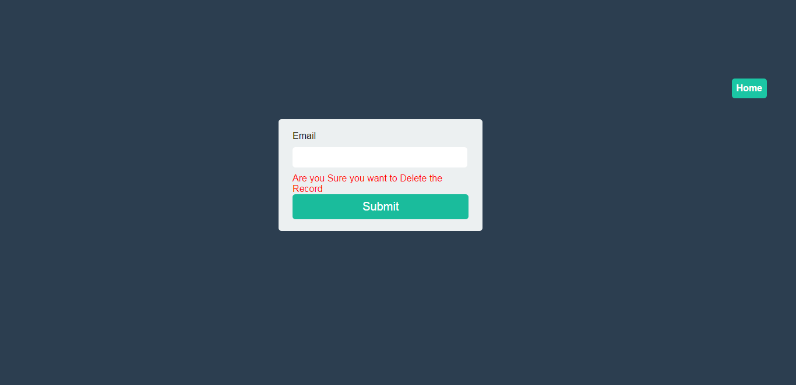

# Forms-Using-HTML-CSS
This will help you to creating different forms...
## Screenshots

These screenshots will give you how the code is going to build forms.

Default template:

 
Home Page should home with all the links

 
Login Form example with username and password

 
Registration Form with The fields of name,email,password,phone and address

 
Delete Form which takes email as id and it will delete the records using email field.
